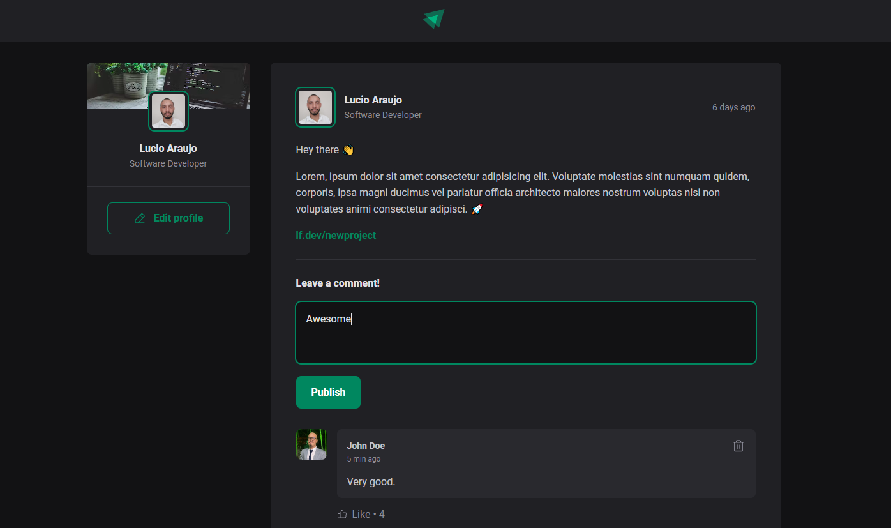

# Ignite Feed
Project developed as part of my ReactJs studies. It contains the fundamentals of React, such as components, props, css modules, states, React DOM, keys, event handling and so much more.

[Click here to view](https://luciofer.github.io/feed-react/)

## 👩🏾‍💻 Technologies

- ReactJS
- JavaScript and TypeScript
- CSS
- Vite
- Figma

## ✉ Contact

contatolucioaraujo@gmail.com

[Linkedin](https://www.linkedin.com/in/lucioaraujo30/)